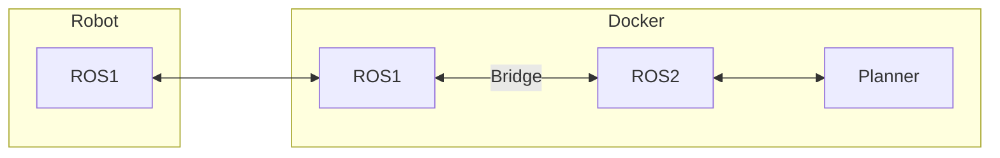
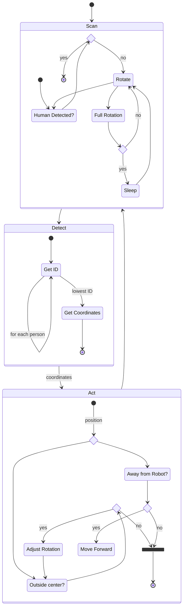

# 🤖 Robotics Assignment

## ✏️ Description

The aim of this project is to communicate and control a [TURTLEBOT 2](http://kobuki.yujinrobot.com/about2) over a local WiFi network. There are two parts to this project, the physical part where we utilise the Turtlebot, by using [Kobuki Node](http://wiki.ros.org/kobuki_node) in [ROS1](https://www.ros.org/). The simulated part uses the same code but along with [Gazebo Garden](https://gazebosim.org/home).

A Docker stack contains the following:

1. `master` - recieves perceptions from either a physical robot or a simulated one (`robot`), uses logic to generate commands and sends them back over a redis channel
2. `robot` - a ROS1 package used on the robot to recieve topics from Kobuki Node, and converts them and sends them over a Redis channel. (`robot` can also be used in simulated mode over Docker)
3. `redis` - used as the Redis server in the simulated version only, in the physical version, the robot has a redis server running on it.

## 🤔 How to run this code (V2)

> Make sure you have [docker & docker-compose](https://docs.docker.com/get-docker/) installed

**☁️ Simulated Version**  

1. Check the `REDIS_URL` in the `.env` file (Should be `redis` for the simulated redis environment)

2. Uncomment everything below `# # For simulated version` in the `docker-compose.yml` file.

3. Navigate to `robot/src/listener.py` and change `#!/usr/bin/env python` to `#!/usr/bin/env python3` (Very first line of the file)

4. Run the master from your computer `docker-compose up` (Might take a little while on the first run)

**🤖 Physical Version**  

1. Check the `REDIS_URL` in the `.env` file (Should be `192.168.0.107` for the robot)

2. Copy over the files (From your local machine):
   `rsync -av ./robot/* ubuntu@192.168.0.107:/home/ubuntu/catkin_make_ws/src/pub_sub_testing`

3. SSH into the robot and run the setup script (From the robot):
   `cd /home/ubuntu/catkin_make_ws/src/pub_sub_testing && bash init.sh`

4. Open up four shells in the robot and run the following:

   - `roslaunch kobuki_node minimal.launch --screen`
   - `roslaunch kobuki_keyop safe_keyop.launch --screen`
   - `roslaunch astra_launch astra.launch`
   - `roslaunch pub_sub_testing pub_sub_testing.launch`

5. Run the master from your computer `docker-compose up` (Might take a little while on the first run)

## 🪲 Troubleshooting

If you want to shell into a particular container for debugging purposes, you can run the following command:

`docker exec -it [container-name] bash`

E.g.

`docker exec -it robotics-assignment-ros1-1 bash`

If you want to test messages going from `ROS1` through the system and back, you can run (From `ROS1` container **OR** Robot)
`rostopic pub /debug/percept std_msgs/String "Hello"`

## 🏗️ Architecture (🚨 OUTDATED)

> This section is from our first iteration of the project (which we had to scrap most of it due to old operating systems)

> Deployment Diagram

Since the Physical robot's dated software can only run `ROS1`, we set up a `ROS1` container that can listen and talk to the robot, the `ROS1` container sends the information it receives to `ROS2` over a Bridge, which allows bidirectional communication between `ROS1` and `ROS2`.

The procedure of finding people and following the first recognized person:

> State Diagram

## 📄 Available Topics (On Kobuki Node)

The following topics are available when running Kobuki Node:

### 📣 Published topics:

| Topic                                                 | Message Type                            |
| ----------------------------------------------------- | --------------------------------------- |
| /camera/depth/image                                   | [sensor_msgs/Image]                     |
| /camera/rgb/image_raw                                 | [sensor_msgs/Image]                     |
| /camera/depth_registered/sw_registered/image_rect     | [sensor_msgs/Image]                     |
| /camera/depth_registered/points                       | [sensor_msgs/PointCloud2]               |
| /cmd_vel_mux/parameter_descriptions                   | [dynamic_reconfigure/ConfigDescription] |
| /mobile_base/events/robot_state                       | [kobuki_msgs/RobotStateEvent]           |
| /mobile_base/debug/raw_data_stream                    | [std_msgs/String]                       |
| /tf                                                   | [tf2_msgs/TFMessage]                    |
| /odom                                                 | [nav_msgs/Odometry]                     |
| /camera/depth/image_raw                               | [sensor_msgs/Image]                     |
| /mobile_base/sensors/core                             | [kobuki_msgs/SensorState]               |
| /camera/rgb_rectify_color/parameter_updates           | [dynamic_reconfigure/Config]            |
| /camera/depth_registered/camera_info                  | [sensor_msgs/CameraInfo]                |
| /camera/camera_nodelet_manager/bond                   | [bond/Status]                           |
| /camera/depth/camera_info                             | [sensor_msgs/CameraInfo]                |
| /keyop_vel_smoother/parameter_updates                 | [dynamic_reconfigure/Config]            |
| /mobile_base/events/button                            | [kobuki_msgs/ButtonEvent]               |
| /camera/depth/image_rect                              | [sensor_msgs/Image]                     |
| /camera/projector/camera_info                         | [sensor_msgs/CameraInfo]                |
| /camera/rgb/camera_info                               | [sensor_msgs/CameraInfo]                |
| /keyop_vel_smoother/parameter_descriptions            | [dynamic_reconfigure/ConfigDescription] |
| /mobile_base/events/power_system                      | [kobuki_msgs/PowerSystemEvent]          |
| /camera/depth_rectify_depth/parameter_updates         | [dynamic_reconfigure/Config]            |
| /cmd_vel_mux/active                                   | [std_msgs/String]                       |
| /diagnostics                                          | [diagnostic_msgs/DiagnosticArray]       |
| /cmd_vel_mux/parameter_updates                        | [dynamic_reconfigure/Config]            |
| /mobile_base/events/digital_input                     | [kobuki_msgs/DigitalInputEvent]         |
| /cmd_vel_mux/safety_controller                        | [geometry_msgs/Twist]                   |
| /camera/depth_registered/image_raw                    | [sensor_msgs/Image]                     |
| /mobile_base/events/wheel_drop                        | [kobuki_msgs/WheelDropEvent]            |
| /camera/depth_registered/sw_registered/camera_info    | [sensor_msgs/CameraInfo]                |
| /mobile_base/debug/raw_control_command                | [std_msgs/Int16MultiArray]              |
| /joint_states                                         | [sensor_msgs/JointState]                |
| /rosout                                               | [rosgraph_msgs/Log]                     |
| /mobile_base/debug/raw_data_command                   | [std_msgs/String]                       |
| /mobile_base/sensors/imu_data_raw                     | [sensor_msgs/Imu]                       |
| /mobile_base/sensors/dock_ir                          | [kobuki_msgs/DockInfraRed]              |
| /rosout_agg                                           | [rosgraph_msgs/Log]                     |
| /camera/driver/parameter_descriptions                 | [dynamic_reconfigure/ConfigDescription] |
| /mobile_base/events/bumper                            | [kobuki_msgs/BumperEvent]               |
| /cmd_vel_mux/keyboard_teleop                          | [geometry_msgs/Twist]                   |
| /mobile_base/commands/velocity                        | [geometry_msgs/Twist]                   |
| /camera/ir/image                                      | [sensor_msgs/Image]                     |
| /diagnostics_toplevel_state                           | [diagnostic_msgs/DiagnosticStatus]      |
| /mobile_base/controller_info                          | [kobuki_msgs/ControllerInfo]            |
| /camera/depth_registered/sw_registered/image_rect_raw | [sensor_msgs/Image]                     |
| /mobile_base/commands/motor_power                     | [kobuki_msgs/MotorPower]                |
| /mobile_base/events/cliff                             | [kobuki_msgs/CliffEvent]                |
| /camera/depth/image_rect_raw                          | [sensor_msgs/Image]                     |
| /camera/depth_rectify_depth/parameter_descriptions    | [dynamic_reconfigure/ConfigDescription] |
| /camera/rgb/image_rect_color                          | [sensor_msgs/Image]                     |
| /keyop_vel_smoother/raw_cmd_vel                       | [geometry_msgs/Twist]                   |
| /camera/rgb_rectify_color/parameter_descriptions      | [dynamic_reconfigure/ConfigDescription] |
| /mobile_base/sensors/imu_data                         | [sensor_msgs/Imu]                       |
| /camera/driver/parameter_updates                      | [dynamic_reconfigure/Config]            |
| /mobile_base_nodelet_manager/bond                     | [bond/Status]                           |
| /camera/ir/camera_info                                | [sensor_msgs/CameraInfo]                |
| /mobile_base/version_info                             | [kobuki_msgs/VersionInfo]               |
| /camera/depth/points                                  | [sensor_msgs/PointCloud2]               |
| /diagnostics_agg                                      | [diagnostic_msgs/DiagnosticArray]       |

### 📡 Subscribed topics:

| Topic                                 | Message Type                      |
| ------------------------------------- | --------------------------------- |
| /tf                                   | [tf2_msgs/TFMessage]              |
| /odom                                 | [nav_msgs/Odometry]               |
| /mobile_base/events/wheel_drop        | [kobuki_msgs/WheelDropEvent]      |
| /mobile_base/commands/reset_odometry  | [std_msgs/Empty]                  |
| /tf_static                            | [tf2_msgs/TFMessage]              |
| /diagnostics                          | [diagnostic_msgs/DiagnosticArray] |
| /cmd_vel_mux/safety_controller        | [geometry_msgs/Twist]             |
| /camera/camera_nodelet_manager/bond   | [bond/Status]                     |
| /mobile_base/commands/external_power  | [kobuki_msgs/ExternalPower]       |
| /rosout                               | [rosgraph_msgs/Log]               |
| /keyop/teleop                         | [kobuki_msgs/KeyboardInput]       |
| /kobuki_safety_controller/disable     | [std_msgs/Empty]                  |
| /mobile_base/commands/sound           | [kobuki_msgs/Sound]               |
| /mobile_base/events/bumper            | [kobuki_msgs/BumperEvent]         |
| /cmd_vel_mux/keyboard_teleop          | [geometry_msgs/Twist]             |
| /mobile_base/commands/digital_output  | [kobuki_msgs/DigitalOutput]       |
| /mobile_base/commands/velocity        | [geometry_msgs/Twist]             |
| /mobile_base/commands/led1            | [kobuki_msgs/Led]                 |
| /mobile_base/commands/led2            | [kobuki_msgs/Led]                 |
| /kobuki_safety_controller/enable      | [std_msgs/Empty]                  |
| /mobile_base/commands/motor_power     | [kobuki_msgs/MotorPower]          |
| /mobile_base/events/cliff             | [kobuki_msgs/CliffEvent]          |
| /keyop_vel_smoother/raw_cmd_vel       | [geometry_msgs/Twist]             |
| /mobile_base_nodelet_manager/bond     | [bond/Status]                     |
| /kobuki_safety_controller/reset       | [std_msgs/Empty]                  |
| /mobile_base/commands/controller_info | [kobuki_msgs/ControllerInfo]      |
