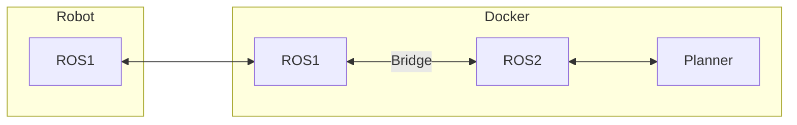
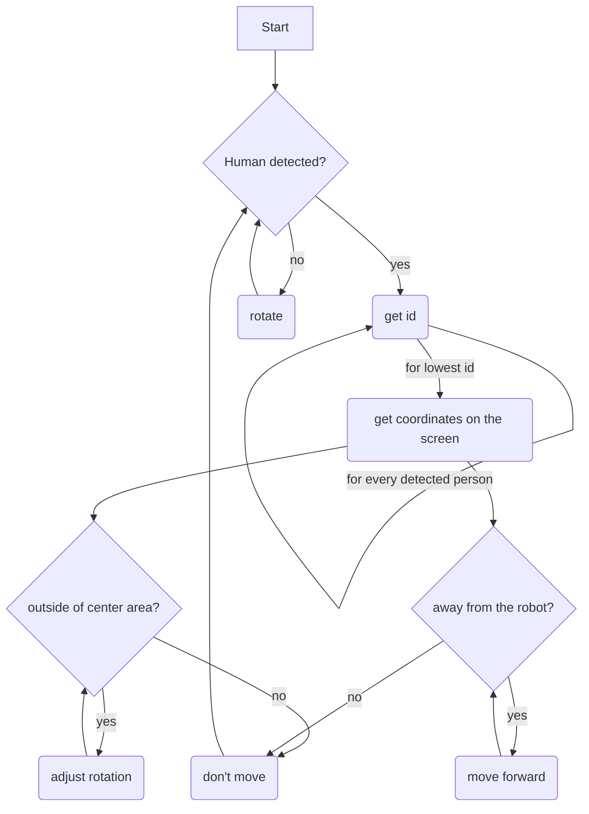

# Robotics Assignment

A Docker stack containing `ROS1`, `ROS2` and a `Bridge` container, which can connect, communicate and control a [TURTLEBOT 2](http://kobuki.yujinrobot.com/about2), over a local WiFi network.

Since the Physical robot's dated software can only run `ROS1`, we set up a `ROS1` container that can listen and talk to the robot, the `ROS1` container sends the information it receives to `ROS2` over a Bridge, which allows bidirectional communication between `ROS1` and `ROS2`.

The procedure of finding people and following the first recognized person:

## How to run

Make sure you have [docker & docker-compose](https://docs.docker.com/get-docker/) installed

Run `docker-compose up` (might take a while on your first run, took me 50 minutes 🙃)

## Controlling the Robot via SSH

First shell:

`roslaunch kobuki_node minimal.launch --screen`

Second shell:

`roslaunch kobuki_keyop safe_keyop.launch --screen`

Third shell:

`roslaunch astra_launch astra.launch`

Fourth shell:

`rqt_image_view`

# Notes

Ros1 is a listener on another topic for only the robot is subscribed to

Topic on the robot to listen for controls made by a controller
